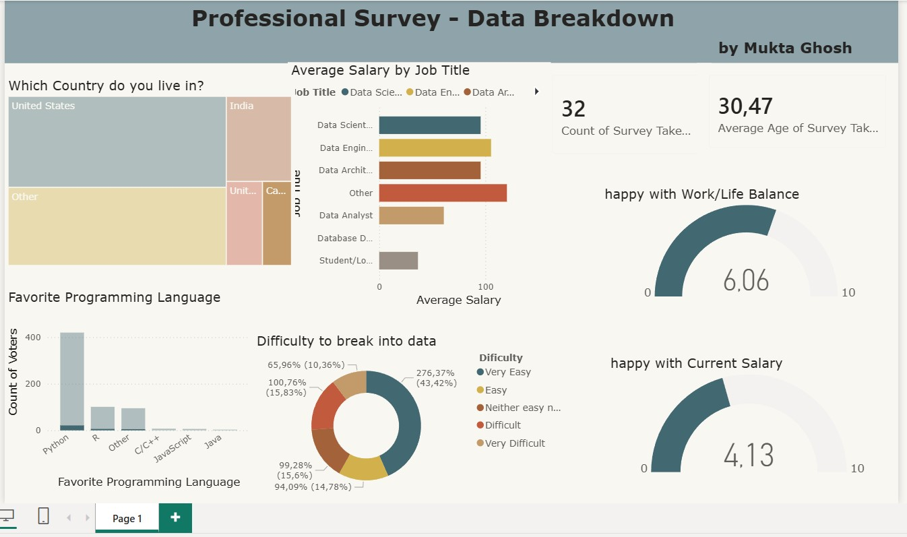

Professional Survey Analysis Dashboard
This Power BI dashboard analyzes professional survey data to uncover trends in salaries, programming language usage, job roles, work-life balance, and salary satisfaction across different countries and professions. The project demonstrates data cleaning, transformation, DAX calculations, and interactive dashboard design using Power BI.

Key insights include:
* Average salary comparison by job title
* Most commonly used programming languages
* Geographic distribution of survey participants
* Employee satisfaction with salary and work-life balance
* Total survey participation metrics

## Dashboard Preview

